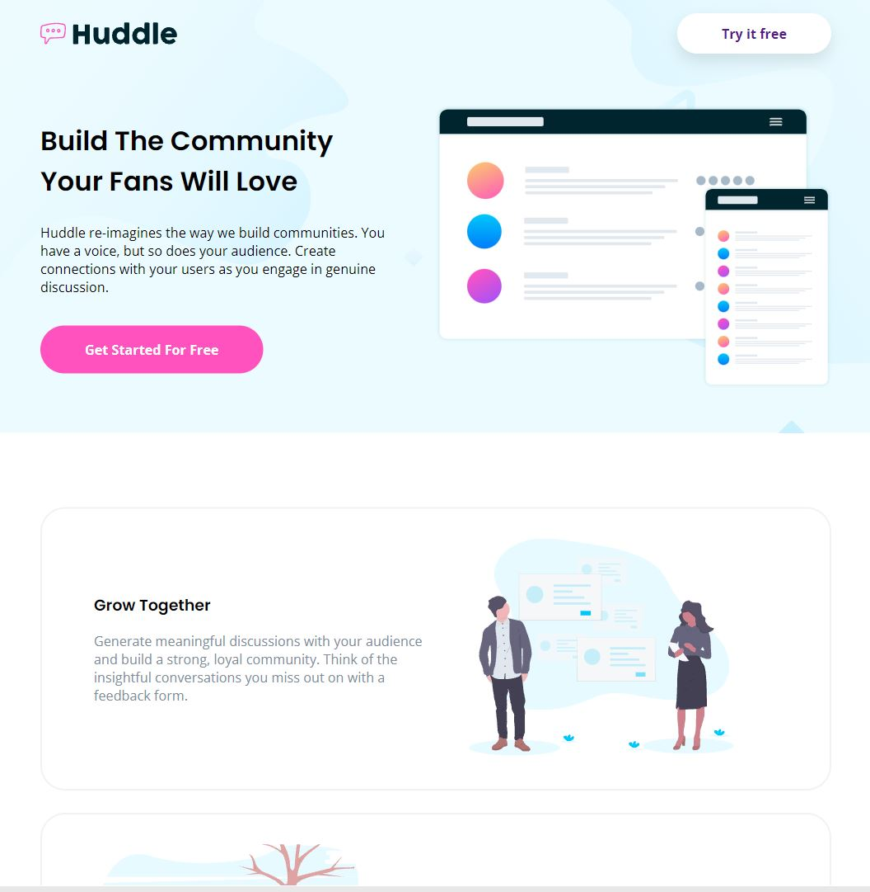
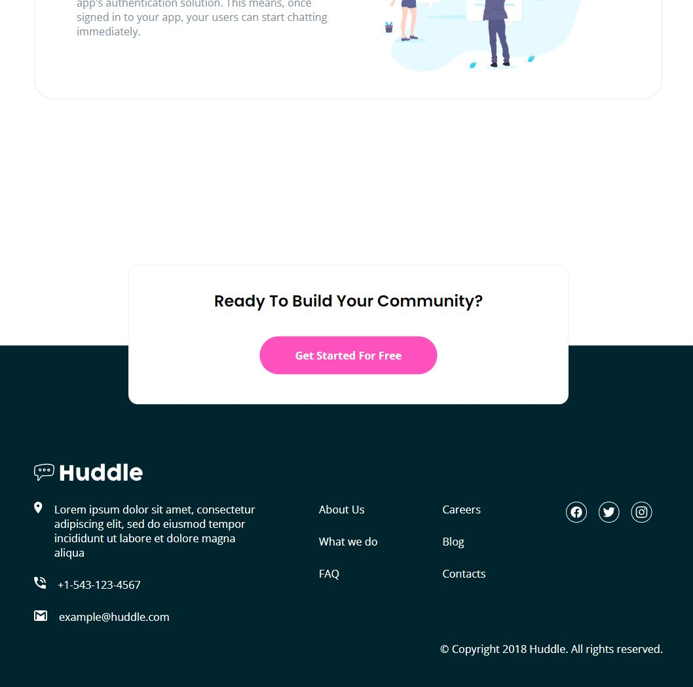

# Huddle Landing Page

This is a solution to the [Huddle landing page with alternating feature blocks challenge on Frontend Mentor](https://www.frontendmentor.io/challenges/huddle-landing-page-with-alternating-feature-blocks-5ca5f5981e82137ec91a5100).

The aim for this challenge is to practice flexbox, background images and responsive design.

## Technologies Used

- HTML structure
- Basic CSS Properties:
  -background color
  -border radius
  -pseudo classes for links (link, visited, hover and active)
  -grid display (reusable classes)(Z pattern)
  -flex display
  -buttons styling
  -media queries with several screen widths, picked after testing (media queries in a separate link):

  - max width: 1400px+
  - max width: 1200px
  - max width: 960px
  - max width: 832px
  - max width: 560px
  - max width: 400px

- Google Fonts link
- ionicons link

## Links

<<<<<<< HEAD
- **Solution URL:** https://github.com/J-B-R-93/Huddle-Landing-Page.git
=======
- URL repo: https://github.com/J-B-R-93/Huddle-Landing-Page.git
- Live site: https://j-b-r-93.github.io/Huddle-Landing-Page/
>>>>>>> 00b95545e8cc6ce95694e46ab55fcf6ba21a6900

- **Live Site URL:** https://j-b-r-93.github.io/Huddle-Landing-Page/

## Screenshot

